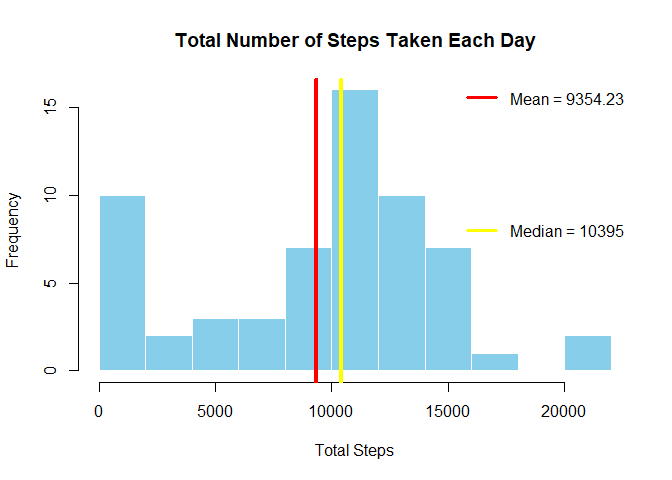
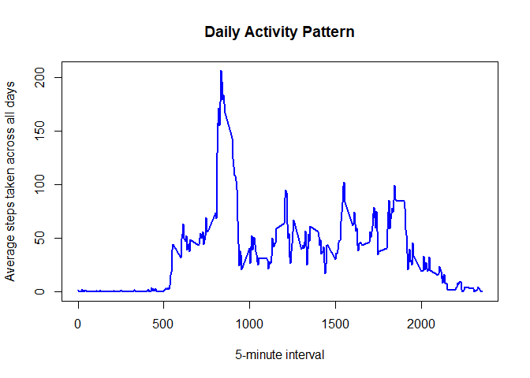
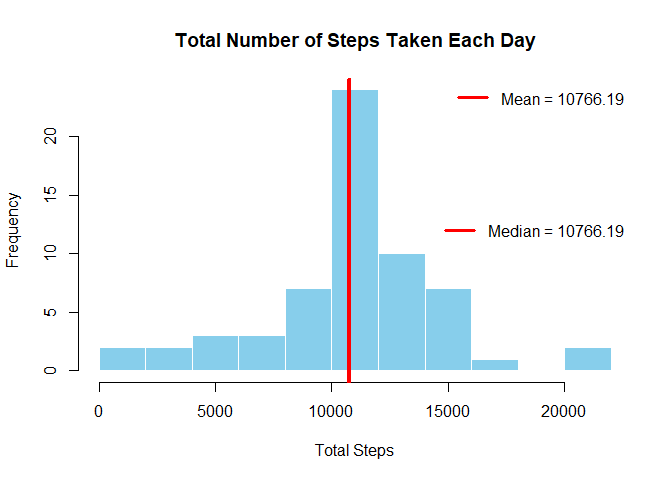
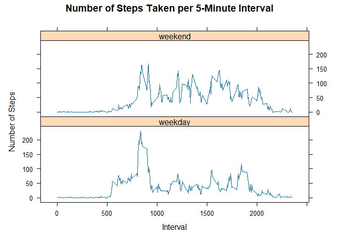

## Loading and preprocessing the data


``` r
## Load in data
unzip(zipfile = "repdata_data_activity.zip")
activity <- read.csv("activity.csv", colClasses = c("integer", "Date", "integer"))
```


``` r
# Data check
dim(activity)
```

```
## [1] 17568     3
```

``` r
str(activity)
```

```
## 'data.frame':	17568 obs. of  3 variables:
##  $ steps   : int  NA NA NA NA NA NA NA NA NA NA ...
##  $ date    : Date, format: "2012-10-01" "2012-10-01" ...
##  $ interval: int  0 5 10 15 20 25 30 35 40 45 ...
```

``` r
head(activity)
```

```
##   steps       date interval
## 1    NA 2012-10-01        0
## 2    NA 2012-10-01        5
## 3    NA 2012-10-01       10
## 4    NA 2012-10-01       15
## 5    NA 2012-10-01       20
## 6    NA 2012-10-01       25
```

``` r
summary(activity)
```

```
##      steps             date               interval     
##  Min.   :  0.00   Min.   :2012-10-01   Min.   :   0.0  
##  1st Qu.:  0.00   1st Qu.:2012-10-16   1st Qu.: 588.8  
##  Median :  0.00   Median :2012-10-31   Median :1177.5  
##  Mean   : 37.38   Mean   :2012-10-31   Mean   :1177.5  
##  3rd Qu.: 12.00   3rd Qu.:2012-11-15   3rd Qu.:1766.2  
##  Max.   :806.00   Max.   :2012-11-30   Max.   :2355.0  
##  NA's   :2304
```

## What is mean total number of steps taken per day?

1. Calculate the total number of steps taken per day

``` r
# Load necessary library
library(dplyr)

# Group by date and sum the steps
daily_steps <- activity %>%
  group_by(date) %>%
  summarize(total_steps = sum(steps, na.rm=TRUE)) # Handling NAs

head(daily_steps, 5) # View first 5 rows
```

```
## # A tibble: 5 × 2
##   date       total_steps
##   <date>           <int>
## 1 2012-10-01           0
## 2 2012-10-02         126
## 3 2012-10-03       11352
## 4 2012-10-04       12116
## 5 2012-10-05       13294
```

2. Make a histogram of the total number of steps taken each day

``` r
# Create the histogram
hist(daily_steps$total_steps,
     main = "Total Number of Steps Taken Each Day",
     xlab = "Total Steps",
     ylab = "Frequency",
     col = "skyblue", 
     border = "white",  
     breaks = 8     
)

# Add a mean and median line
abline(v = mean(daily_steps$total_steps), col = "red", lwd = 4)
abline(v = median(daily_steps$total_steps), col = "yellow", lwd = 4)

# Add legends
legend("topright", legend = paste("Mean =", round(mean(daily_steps$total_steps), 2)),
       col = "red", lwd = 3, bty = "n") 
legend("right", legend = paste("Median =", round(median(daily_steps$total_steps), 2)), 
       col = "yellow", lwd = 3, bty = "n") 
```

<!-- -->

3. Calculate and report the mean and median of the total number of steps taken per day


``` r
# Calculate the mean and median of the total number of steps taken per day
summary_stats <- daily_steps %>%
  summarise(mean_steps = mean(total_steps),
            median_steps = median(total_steps))

# Report the mean and median 
cat("Mean number of steps taken per day:", summary_stats$mean_steps, "\n")
```

```
## Mean number of steps taken per day: 9354.23
```

``` r
cat("Median number of steps taken per day:", summary_stats$median_steps, "\n")
```

```
## Median number of steps taken per day: 10395
```


## What is the average daily activity pattern?

1. Make a time series plot (i.e. type = "l") of the 5-minute interval (x-axis) and the average number of steps taken, averaged across all days (y-axis)


``` r
# Load necessary library
library(dplyr)

# Calculate the average number of steps for each 5-minute interval across all days
interval_avg <- activity %>%
  group_by(interval) %>%
  summarize(avg_steps = mean(steps, na.rm = TRUE))

# Create the time series plot 
plot(interval_avg$interval, interval_avg$avg_steps, type = "l",
     xlab = "5-minute interval", ylab = "Average steps taken across all days",
     main = "Daily Activity Pattern",
     col = "blue",
     lwd = 2)  
```

<!-- -->


2. Which 5-minute interval, on average across all the days in the dataset, contains the maximum number of steps?


``` r
# Find the interval with the maximum average steps
max_interval <- interval_avg[which.max(interval_avg$avg_steps), ]

# Report the result
cat("The 5-minute interval with the maximum average number of steps is:", max_interval$interval, "\n")
```

```
## The 5-minute interval with the maximum average number of steps is: 835
```


## Imputing missing values

1. Calculate and report the total number of missing values in the dataset (i.e. the total number of rows with NA NAs)


``` r
# Calculate the total number of missing values in the dataset
total_missing <- sum(is.na(activity))

# Report the result
cat("Total number of missing values in the activity dataset:", total_missing, "\n")
```

```
## Total number of missing values in the activity dataset: 2304
```

2. Devise a strategy for filling in all of the missing values in the dataset and Create a new dataset that is equal to the original dataset but with the missing data filled in.


``` r
library(dplyr)
# Impute missing values in the 'steps' column based on the mean for each interval
activity_imputed <- activity %>%
  left_join(interval_avg, by = "interval") %>%
  mutate(steps = ifelse(is.na(steps), avg_steps, steps)) %>%
  select(-avg_steps)

# Verify that there are no more missing values in the 'steps' column
cat("Number of missing values after imputation:", sum(is.na(activity_imputed$steps)), "\n")
```

```
## Number of missing values after imputation: 0
```

``` r
# Print the first 5 rows of the datasets
head(activity, 5)
```

```
##   steps       date interval
## 1    NA 2012-10-01        0
## 2    NA 2012-10-01        5
## 3    NA 2012-10-01       10
## 4    NA 2012-10-01       15
## 5    NA 2012-10-01       20
```

``` r
head(activity_imputed, 5)
```

```
##       steps       date interval
## 1 1.7169811 2012-10-01        0
## 2 0.3396226 2012-10-01        5
## 3 0.1320755 2012-10-01       10
## 4 0.1509434 2012-10-01       15
## 5 0.0754717 2012-10-01       20
```

3. Make a histogram of the total number of steps taken each day and calculate and report the mean and median total number of steps taken per day. Do these values differ from the estimates from the first part of the assignment? What is the impact of imputing missing data on the estimates of the total daily number of steps?


``` r
library(dplyr)

# Group by date and sum the steps (using imputed data)
daily_steps_imputed <- activity_imputed %>%
  group_by(date) %>%
  summarize(total_steps = sum(steps))

# Print the first few 5 rows to check results
head(daily_steps_imputed, 5)
```

```
## # A tibble: 5 × 2
##   date       total_steps
##   <date>           <dbl>
## 1 2012-10-01      10766.
## 2 2012-10-02        126 
## 3 2012-10-03      11352 
## 4 2012-10-04      12116 
## 5 2012-10-05      13294
```

``` r
# Create the histogram
hist(daily_steps_imputed$total_steps,
     main = "Total Number of Steps Taken Each Day",
     xlab = "Total Steps",
     ylab = "Frequency",
     col = "skyblue", 
     border = "white",  
     breaks = 8     
)

# Add a mean line
abline(v = mean(daily_steps_imputed$total_steps), col = "red", lwd = 4)

# Add legends
legend("topright", legend = paste("Mean =", round(mean(daily_steps_imputed$total_steps), 2)),
       col = "red", lwd = 3, bty = "n") 
legend("right", legend = paste("Median =", round(median(daily_steps_imputed$total_steps), 2)), 
       col = "red", lwd = 3, bty = "n") 
```

<!-- -->

``` r
# Calculate the mean and median of the total number of steps taken per day (using imputed data)
Imputed_summary_stats <- daily_steps_imputed %>%
  summarise(mean_steps = mean(total_steps),
            median_steps = median(total_steps))

# Report the mean and median 
cat("Mean number of steps taken per day (imputed data):", Imputed_summary_stats$mean_steps, "\n")
```

```
## Mean number of steps taken per day (imputed data): 10766.19
```

``` r
cat("Median number of steps taken per day (imputed data):", Imputed_summary_stats$median_steps, "\n")
```

```
## Median number of steps taken per day (imputed data): 10766.19
```

Initially, the mean daily steps (excluding NAs) was 9354.23, and the median was 10395. After imputing missing values using the mean for each 5-minute interval, both the mean and median daily steps became 10766.19.

The imputation resulted in a substantial increase in the mean daily steps (15.1%), suggesting that the missing values tended to occur during periods of lower activity. Because the *mean* was lower than the *median*, the imputation strategy *increased the mean more so than the median*, leading to an equal mean and median. This imputation strategy forces the two parameters to be exactly the same.


## Are there differences in activity patterns between weekdays and weekends?

1. Create a new factor variable in the dataset with two levels – “weekday” and “weekend” indicating whether a given date is a weekday or weekend day.


``` r
library(dplyr)
library(lubridate)
# Use the dataset with the filled-in missing values for this part
# Create a new factor variable 'day_type' indicating weekday or weekend
activity_imputed <- activity_imputed %>%
  mutate(day_type = ifelse(wday(date, label = TRUE) %in% c("Sat", "Sun"), "weekend", "weekday"))

# Convert 'day_type' to a factor
activity_imputed$day_type <- as.factor(activity_imputed$day_type)

# Print the first 5 rows to verify the new column
head(activity_imputed, 5)
```

```
##       steps       date interval day_type
## 1 1.7169811 2012-10-01        0  weekday
## 2 0.3396226 2012-10-01        5  weekday
## 3 0.1320755 2012-10-01       10  weekday
## 4 0.1509434 2012-10-01       15  weekday
## 5 0.0754717 2012-10-01       20  weekday
```

2. Make a panel plot containing a time series plot (i.e. type = "l" type = "l") of the 5-minute interval (x-axis) and the average number of steps taken, averaged across all weekday days or weekend days (y-axis). 


``` r
library(dplyr)
library(lattice)

# Calculate the average number of steps for each 5-minute interval, grouped by day_type
interval_avg_daytype <- activity_imputed %>%
  group_by(interval, day_type) %>%
  summarize(avg_steps = mean(steps, na.rm = TRUE))

# Print the first 5 rows to check results
head(interval_avg_daytype, 5)
```

```
## # A tibble: 5 × 3
## # Groups:   interval [3]
##   interval day_type avg_steps
##      <int> <fct>        <dbl>
## 1        0 weekday     2.25  
## 2        0 weekend     0.215 
## 3        5 weekday     0.445 
## 4        5 weekend     0.0425
## 5       10 weekday     0.173
```

``` r
# Make the panel plot
xyplot(avg_steps ~ interval | day_type, data = interval_avg_daytype,
       type = "l",
       lwd = 1,
       xlab = "Interval",
       ylab = "Number of Steps",
       main = "Number of Steps Taken per 5-Minute Interval",
       layout = c(1, 2),
       par.settings = list(
         plot.background = list(col = "peachpuff"),  
         strip.background = list(col = "peachpuff")  
       ))
```

<!-- -->
